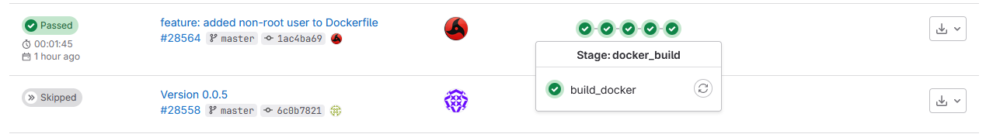

# DevOps-Prueba

Repo de prueba técnica DevOps

Para este proyecto se realizaron las siguientes tareas.

- Configuracion del pipeline utilizando GitLab CI/CD.
- Configuracion de variables para el proyecto, dentro del repo (GitLab).
- Configuracion del Dockerfile.
- Creacion del secret en el cluster (kubernetes v1.23.6).
- Despliegue del servicio en el cluster mediante el comando kubectl.

Porque utilice GitLab instalado on-premise para la realizacion de este proyecto? Me resulta mas comodo ya que tengo acceso a un ambiente funcional.

En la siguiente imagen podemos ver un vistazo general de los distintos jobs que componen el pipeline.

Los jobs que se ejecutan son los siguientes.

- setup
- bump_version
- test
- docker_build
- prep_deployment_files
- update_branch

En la siguiente imagen podemos ver una vista general de como luce la ejecucion del pipeline, con varias integraciones ya hechas en la rama master.


En la siguiente imagen podemos ver el ciclo completo de ejecucion de un pipeline, pasaremos a detallar cada paso.


Aqui podemos ver el job que realiza la actualizacion de la version del proyecto.


Utilizo siempre el [SemVer](https://semver.org/) para el versionamiento de los servicios. 


En los Jobs correspondientes a los test, tenemos 2
uno para realizar las pruebas unitarias, y otro para la verificacion de codigo estatico con la herramienta sonarqube.


Para el control de codigo estatico utilizo la herramienta Sonarqube, previamente configurada para integrarse con el Gitlab, en la siguiente imagen vemos como genera un link con el reporte de esta integracion.


Aqui podemos ver una vista general del reporte que fue generado dentro del Sonarqube.


Aqui tenemos la vista general, pero con los ultimos cambios que fueron integrados.


Luego tenemos la vista general de la totalidad de los cambios integrados en este proyecto.


Los Security Hotspots pueden ser visualizados en la siguiente imagen.


Como  ultimo paso dentro del Sonarqube podemos ver los issues que fueron detectados.


Volviendo a los test podemos verificar la ejecucion de los test unitarios. Si alguno de estos test llega a fallar, el pipeline falla y no permite la integracion de la fuente ni la generacion de la imagen de docker.


Continuando con los Jobs del pipeline, una vez concluida las pruebas, generamos la imagen con Docker.



Podemos ver que la imagen fue buildeada correctamente y luego realizo el envio de la misma al registry local.


El siguiente Job se encarga de modificar las variables con los templates y generar los archivos yaml correspondientes a los deployments para luego ser utilizados para el despliegue de la aplicacion dentro  del cluster de kubernetes.


El Job, imprime unas variables configuradas en el Gitlab, y luego modifica el tag de la imagen a ser utilizada.
Los archivos generados corresponden a:

- Deployment
- Service
- Hpa
- Ingress


Esta es la vista general con los Jobs relacionados a actualizar las ramas, tanto del repo con el codigo fuente, como del repositorio con los archivos de deployments.


Comenzamos actualizando el repositorio con los archivos de deployments.


Aqui realizamos la actualizacion del repositorio con la version obtenida del Job bump_version.


Con esto terminamos el recorrido por las tareas del pipeline.

## Despliegue en ambiente de desarrollo

Para realizar el despliegue dentro de cluster, utilizamos archivos en formato yaml, que contienen toda la info necesaria para desplegar la aplicacion.
Un template de cada archivo esta guardado dentro de las variables del repositorio del proyecto (GitLab instalado on-prem).


Los archivos yaml son utilizados para el despliegue de la aplicacion en kubernetes.


Pasamos describir brevemente que hace cada  uno.

### 1_deployment.yml

Tiene datos relacionados a la imagen y el tag a ser utilizado, como asi tambien la cantidad de recursos maximos y minimos como memoria o cpu y datos relativos al secret, o las variables que seran montadas dentro del pod.

```yaml
apiVersion: apps/v1
kind: Deployment
metadata:
  name: deploy-demo-devops-python
  namespace: demo
spec:
  minReadySeconds: 10
  strategy:
    rollingUpdate:
      maxSurge: 1
      maxUnavailable: 0
    type: RollingUpdate
  selector:
    matchLabels:
      app: deploy-demo-devops-python
  template:
    metadata:
      name: deploy-demo-devops-python
      labels:
        app: deploy-demo-devops-python
    spec:
      imagePullSecrets:
        - name: regcred
      enableServiceLinks: false
      containers:
        - image: registry-local:5000/admin/demo_devops:0.0.6
          resources:
            limits:
              cpu: "800m"
              memory: "400Mi"
            requests:
              cpu: 30m
              memory: 50Mi
          name: deploy-demo-devops-python
          imagePullPolicy: Always
          volumeMounts:
            - name: volume-demo-devops-python
              mountPath: /app/.env
              subPath: dev-demo-devops-python-env
      volumes:
        - name: volume-demo-devops-python
          secret:
            secretName: demo-devops-env
```

### 2_service.yml

Contiene los datos relacionados a la forma en la cual nos conectaremos al pod, en este caso estoy utilizando un servicio de tipo ClusterIP, que no es accesible directamente desde fuera del cluster, pero en este caso esta no sera la forma directa de exponer el servicio, para eso ulizaremos el ingress nginx encima del CLusterIP, hablaremos de eso mas adelante.

```yaml
apiVersion: v1
kind: Service
metadata:
  name: service-demo-devops-python
  namespace: demo
spec:
  type: ClusterIP
  ports:
    - port: 8000
      targetPort: 8000
      name: service-demo-devops-python
  selector:
    app: deploy-demo-devops-python
```

### 3_ingress.yml

El ingress es la forma en la cual vamos a exponer el servicio fuera del cluster, en este caso utilizamos el path-routing para poder rutear el trafico hacia nuestro pod.

```yaml
apiVersion: networking.k8s.io/v1
kind: Ingress
metadata:
  name: ingress-demo-devops-python
  namespace: demo
spec:
  ingressClassName: nginx
  rules:
  - host: dev-bops-02.bepsa.com.py
    http:
      paths:
      - path: /api
        pathType: Prefix
        backend:
          service:
            name: service-demo-devops-python
            port:
              number: 8000
```

### 4_hpa.yml

Con esta configuracion realizamos el escalamiento horizontal de pods, que nos permite aumentar automaticamente la cantidad de pods de acuerdo a ciertas metricas de uso de recursos, para este caso es cuando el servicio use  mas de 300 megas de memoria.

```yaml
apiVersion: autoscaling/v2
kind: HorizontalPodAutoscaler
metadata:
  name: autoscale-demo-devops-python
  namespace: demo
spec:
  scaleTargetRef:
    apiVersion: apps/v1
    kind: Deployment
    name: deploy-demo-devops-python
  minReplicas: 1
  maxReplicas: 10
  metrics:
  - type: Resource
    resource:
      name: memory
      target:
        type: AverageValue
        averageValue: 300Mi
```

## Dockerfile

Pasamos a describir el Dockerfile, utilice una imagen con python 3.11.3, podemos resumir los pasos realizados de la siguiente manera:

1. Seleccionamos una imagen base apropiada, en este caso una imagen ligera (slim-buster).
2. Instalamos las dependencias necesarias.
3. Copiamos los archivos necesarios dentro de la imagen.
4. Ejecutamos los scripts para la generacion de tablas para la base de datos.
5. Creamos un usuario sin privilegios de sudo.
6. Ejecutamos la aplicacion con el usuario creado anteriormente.


### Plan de mejora

Una forma en la que se podria mejorar la forma de exponer la aplicacion seria utilizar gunicorn para servir lo relacionado a Python, e instalar nginx para servir los archivos estaticos.

## Secrets

Las aplicaciones por lo general necesitan datos sencibles (credenciales, tokens, etc) que no deben estar presentes en los repositorios de fuentes, ya que implican un riesgo muy alto en cuanto a seguridad.
Estos datos deben ser disponibilizados dentro del cluster como configmaps o secrets.
Para este caso utilice cree un secret con el contenido del archivo .env
En la imagen se muestra el comando utilizado para la creacion del mismo.


Este secret es montado dentro del pod, para que la aplicacion pueda utilizarlo al momento de iniciar.

## Deploy de la aplicacion

Para automatizar el proceso de deploy de la aplicacion en mi dia a dia utilizo ArgoCD, que se encarga de leer los archivos de deployments y verificar si existe alguna diferencia, si encuentra diferencias entre lo que se encuentra en los archivos de deployment y lo que tiene deplegado en el cluster, el se encarga de aplicar los cambios (puede ser automaticamente, o de forma manual desde una consola de administracion).
Para este ejercicio por motivos de fuerza mayor no puedo utilizar el ArgoCD, pero en la siguiente imagen muestro como realize el deploy utilizando 'kubectl' en minikube.


## Escaneo de vulnerabilidades

Intente realizar la verificacion de vulnerabilidades a nivel de la imagen de Docker, pero tuve unos problemas por la forma en la que se encuentra instalado el runner del GitLab.
El runner es el encargado de ejecutar todos los jobs que componen el pipeline, y modificar el mismo podria repercutir en los demas pipelines que corren en el mismo.
De igual manera adjunto la imagen del Job correspondiente.


